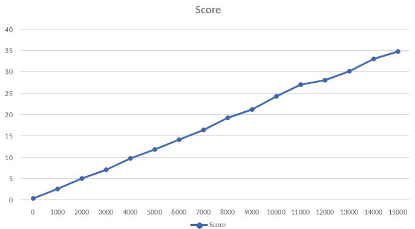

# Замеры JMH / JMH measurements

Реализованы замеры производительности алгоритма хэширования ГОСТ 34.11-2018 (Стрибог)

Часть курсового проекта [ГОСТ 34.10-2018](https://https://github.com/shomov/GOST-34.10-2018)

Implemented and measured the performance of the hashing algorithm of GOST 34.11-2018 (Stribog)

Part of the course project [GOST 34.10-2018](https://https://github.com/shomov/GOST-34.10-2018)

| Benchmark                              | Mode | Threads | Samples | Score     | Score Error (99,9%) | Unit  | Param: msgSize |
|----------------------------------------|------|---------|---------|-----------|---------------------|-------|----------------|
| jmh.MyBenchmark.BenchTest.StribogBench | avgt | 1       | 5       | 0,472682  | 0,093146            | ms/op | 0              |
| jmh.MyBenchmark.BenchTest.StribogBench | avgt | 1       | 5       | 2,691031  | 0,397345            | ms/op | 1000           |
| jmh.MyBenchmark.BenchTest.StribogBench | avgt | 1       | 5       | 5,131784  | 0,978233            | ms/op | 2000           |
| jmh.MyBenchmark.BenchTest.StribogBench | avgt | 1       | 5       | 7,179261  | 1,313845            | ms/op | 3000           |
| jmh.MyBenchmark.BenchTest.StribogBench | avgt | 1       | 5       | 9,861718  | 2,028104            | ms/op | 4000           |
| jmh.MyBenchmark.BenchTest.StribogBench | avgt | 1       | 5       | 11,926847 | 1,980416            | ms/op | 5000           |
| jmh.MyBenchmark.BenchTest.StribogBench | avgt | 1       | 5       | 14,228337 | 2,454271            | ms/op | 6000           |
| jmh.MyBenchmark.BenchTest.StribogBench | avgt | 1       | 5       | 16,503992 | 3,049025            | ms/op | 7000           |
| jmh.MyBenchmark.BenchTest.StribogBench | avgt | 1       | 5       | 19,352452 | 4,576547            | ms/op | 8000           |
| jmh.MyBenchmark.BenchTest.StribogBench | avgt | 1       | 5       | 21,296562 | 5,098029            | ms/op | 9000           |
| jmh.MyBenchmark.BenchTest.StribogBench | avgt | 1       | 5       | 24,3831   | 3,842897            | ms/op | 10000          |
| jmh.MyBenchmark.BenchTest.StribogBench | avgt | 1       | 5       | 27,123238 | 8,780149            | ms/op | 11000          |
| jmh.MyBenchmark.BenchTest.StribogBench | avgt | 1       | 5       | 28,166273 | 3,989920            | ms/op | 12000          |
| jmh.MyBenchmark.BenchTest.StribogBench | avgt | 1       | 5       | 30,273232 | 3,626145            | ms/op | 13000          |
| jmh.MyBenchmark.BenchTest.StribogBench | avgt | 1       | 5       | 33,152033 | 5,283613            | ms/op | 14000          |
| jmh.MyBenchmark.BenchTest.StribogBench | avgt | 1       | 5       | 34,88625  | 7,269559            | ms/op | 15000          |

Михаил Шомов

Mikhail Shomov

mikle@shomov.spb.ru
